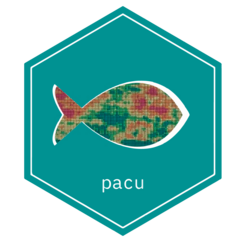

# pacu: Precision Agriculture Computational Utilities 

The *pacu* package allows for processing, visualization, and analysis of yield monitor data. Additionally, this package also allows for retrieval, processing, and visualization of weather and satellite data.

## Installation

pacu is not yet available on CRAN. To install pacu from github you can try:

> devtools::install_github("cldossantos/pacu")\
> library(pacu)

The vignettes are not automatically built when the package is installed from github. To get started with pacu, you can build the vignettes and check the examples we provide.

> devtools::install_github("cldossantos/pacu", build_vignettes = TRUE)\
> browseVignettes(package = 'pacu')

## Package requirements

Imported packages: stars, XML, gstat, units, sf, apsimx, tmap, httr, jsonlite

Suggested packages: spData, knitr, mgcv, concaveman, rmarkdown, ggplot2, patchwork, nasapower, testthat

## Manuscript preprint

You can find a preprint of the manuscript describing *pacu* [here](http://ssrn.com/abstract=4946676)
