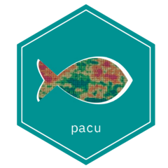

# pacu: Precision Agriculture Computational Utilities 

[](https://CRAN.R-project.org/package=pacu)
[](https://github.com/r-hub/cranlogs.app)
[](https://cran.r-project.org/package=pacu)

The *pacu* package supports common precision agriculture workflows in R. It includes tools to process and visualize yield monitor data from production and experimental fields, retrieve and summarize weather data, and download or summarize Sentinel-2 satellite imagery.

Key capabilities:

- **Yield monitor processing** — process and visualize yield monitor data from production and experimental fields, with quality checks and mapping workflows using either a simple method or the RITAS algorithm
- **Weather data** — download and summarize daily weather records from IEM and NASA POWER as APSIM-compatible met objects
- **Sentinel-2 imagery** — authenticate with Copernicus Data Space, browse available scenes, download archives, and compute vegetation indices (NDVI, NDRE, EVI, and others)


## Getting started

Full tutorials are available as package vignettes:

- [Introduction to pacu](https://CRAN.R-project.org/package=pacu/vignettes/pacu.html)
- [Yield monitor processing](https://CRAN.R-project.org/package=pacu/vignettes/pacu_ym.html)
- [Weather data](https://CRAN.R-project.org/package=pacu/vignettes/pacu_weather.html)
- [Sentinel-2 satellite imagery](https://CRAN.R-project.org/package=pacu/vignettes/pacu_sat.html)
- [FAQ](https://CRAN.R-project.org/package=pacu/vignettes/pacu_faq.html)

A minimal example — check and process raw yield monitor data:

```r
library(pacu)

extd.dir <- system.file("extdata", package = "pacu")
raw.yield <- sf::read_sf(file.path(extd.dir, "2012-basswood.shp"))
boundary  <- sf::read_sf(file.path(extd.dir, "boundary.shp"))

pa_check_yield(input = raw.yield)

ymp <- pa_yield(
  input          = raw.yield,
  boundary       = boundary,
  algorithm      = "simple",
  unit.system    = "metric",
  lbs.per.bushel = 56
)

pa_plot(ymp)
```

## Installation

pacu is available on CRAN:

```r
install.packages("pacu")
```


To install the development version from GitHub, use either `devtools` or `remotes`:

```r
devtools::install_github("cldossantos/pacu")
library(pacu)
```

```r
remotes::install_github("cldossantos/pacu")
library(pacu)
```

Vignettes are not built automatically when the package is installed from GitHub. If you want the full tutorials, install with vignette building enabled:

```r
devtools::install_github("cldossantos/pacu", build_vignettes = TRUE)
browseVignettes(package = "pacu")
```

```r
remotes::install_github("cldossantos/pacu", build_vignettes = TRUE)
browseVignettes(package = "pacu")
```


## Package requirements

Core imports: `stars`, `XML`, `gstat`, `units`, `sf`, `apsimx`, `tmap`, `httr`, `jsonlite`

Suggested packages for examples, visualization, and development: `spData`, `knitr`, `mgcv`, `concaveman`, `rmarkdown`, `ggplot2`, `patchwork`, `nasapower`, `testthat`

## Manuscript

The manuscript describing *pacu* is available [here](https://doi.org/10.1016/j.softx.2024.101971).
